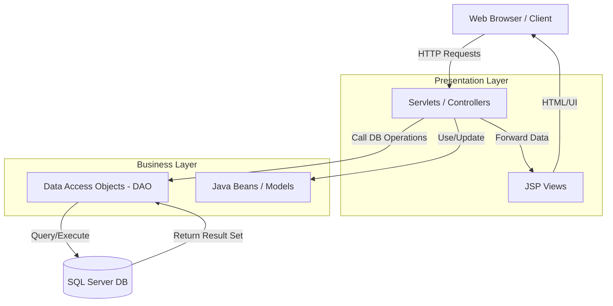
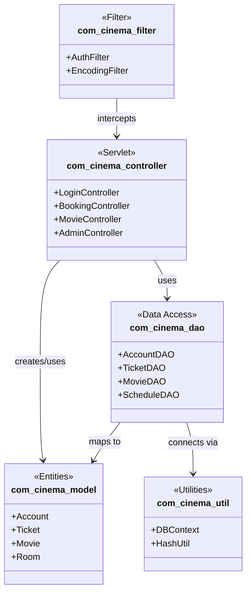
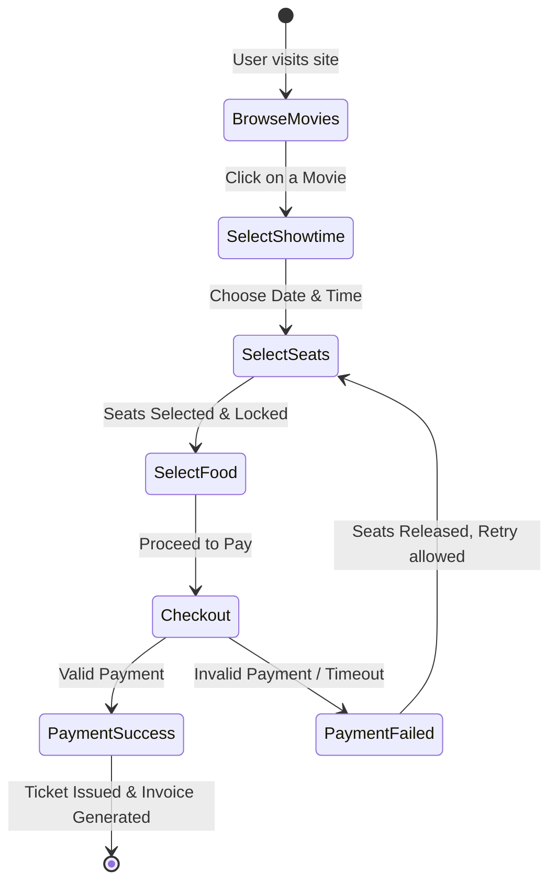
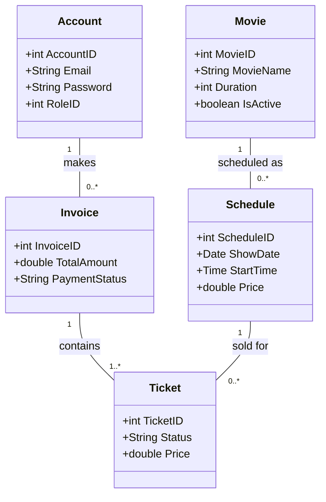
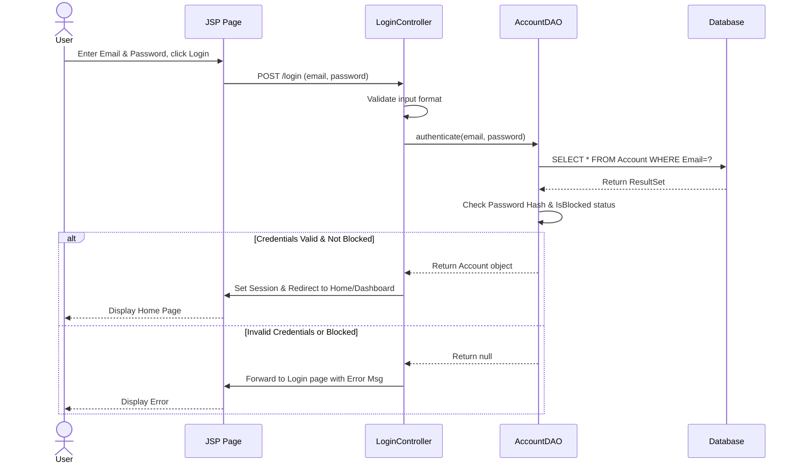
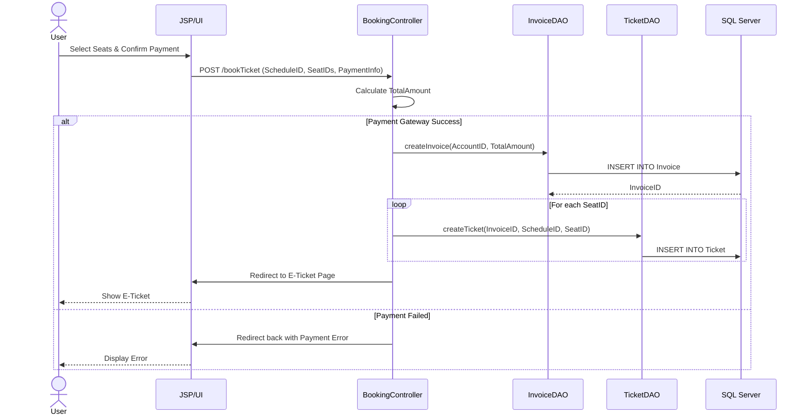
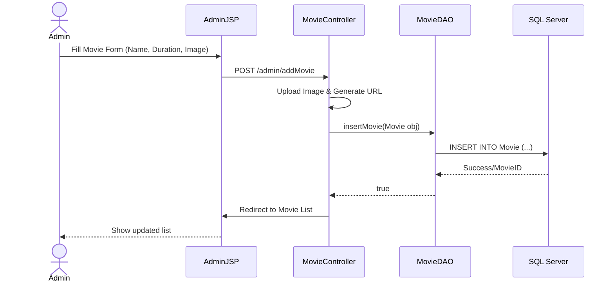

# SOFTWARE DESIGN SPECIFICATION
**Project Name (Code): Movies_theater**
– Hanoi, July 2026 –

## Table of Contents
I. Record of Changes
II. Software Design Document
1. High Level Design
    1.1 Software Architecture
    1.2 Package Diagram
    1.3 Database Design
2. State Transition Diagrams
    2.1 User Authentication State
    2.2 Ticket Booking Process State
3. Detailed Design
    3.1 Class Diagrams (Domain Model)
    3.2 Authentication & User Management (Sequence)
    3.3 Ticket Booking & Payment (Sequence)
    3.4 Movie & Schedule Management (Sequence)

---

## I. Record of Changes

| Date | A*M, D | In charge | Change Description |
|---|---|---|---|
| 13/07/2026 | A | AI Assistant | Initialized the SDS document based on SRS |
| 13/07/2026 | M | AI Assistant | Expanded to cover full Database Schema (20 tables) and detailed Use Cases |

*\*A - Added, M - Modified, D - Deleted*

---

## II. Software Design Document

### 1. High Level Design

#### 1.1 Software Architecture
The Movies Theater system utilizes a classic **MVC (Model-View-Controller)** architecture built with Java technologies (Servlets and JSP).

#### 1.2 Package Diagram

#### 1.3 Database Design
The system's database, `CinemaBookingDB`, comprises 20 interconnected tables supporting user management, movie metadata, theater layout, scheduling, and transactions.

**(1) Role & Account Management**
- `Role`: (RoleID PK, RoleName). Defines Admin, Customer, Employee.
- `Account`: (AccountID PK, Email, Password, RoleID FK, IsBlocked). Core credentials.
- `UserProfile`: (AccountID PK/FK, FullName, PhoneNumber, DoB, Address, AvatarURL).
- `UnlockRequest`: Logs requests from blocked users to be unblocked by Admin.

**(2) Movie Information**
- `Movie`: (MovieID PK, MovieName, Duration, ReleaseDate, Poster, Trailer, IsActive...).
- `Genre`: (GenreID PK, GenreName).
- `MovieGenre`: Junction table (MovieID FK, GenreID FK).
- `MovieReview`: (ReviewID PK, MovieID FK, AccountID FK, Rating, Comment).

**(3) Cinema Layout & Scheduling**
- `Room`: (RoomID PK, RoomNumber, RoomType, Capacity, IsActive).
- `Seat`: (SeatID PK, RoomID FK, RowChar, ColNumber, SeatType).
- `Schedule`: (ScheduleID PK, MovieID FK, RoomID FK, ShowDate, StartTime, EndTime, Price).

**(4) Booking & Transactions**
- `Ticket`: (TicketID PK, InvoiceID FK, ScheduleID FK, SeatID FK, Price, Status).
- `Invoice`: (InvoiceID PK, AccountID FK, TotalAmount, PromotionID FK, PaymentMethod, PaymentStatus).
- `Food`: (FoodID PK, FoodName, Price, Image, IsActive).
- `InvoiceFood`: Junction mapping food purchased in an invoice.
- `Promotion`: (PromotionID PK, Code, DiscountAmount, ValidFrom, ValidTo).

**(5) Employee Management & Logging**
- `WorkShift`: Employee shift tracking.
- `ShiftExchangeRequest`: Shift hand-offs raised by an employee and approved or declined by a Manager.
- `SystemConfig` & `SystemLog`: App configurations and audit logs.

---

### 2. State Transition Diagrams

#### 2.1 Ticket Booking State (State Transition Diagram)

---

### 3. Detailed Design

#### 3.1 Domain Model Class Diagram

#### 3.2 Authentication & User Management Sequence (UC01 - UC02)

**Sequence Diagram for Login Process**

#### 3.3 Ticket Booking & Payment Sequence

**Sequence Diagram for Ticket Booking**

#### 3.4 Movie Management (Admin) Sequence

**Sequence Diagram for Adding a Movie**

